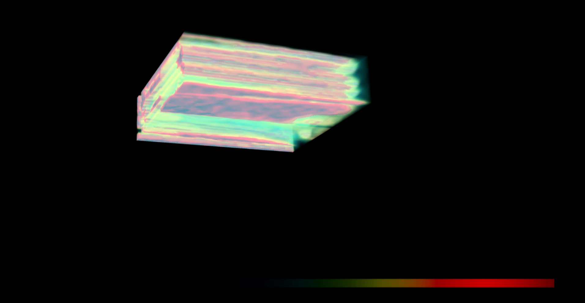

# 🌌HoloOcean  
### Tensor Geofísico Quântico-Simbiótico com Reconstrução 3D

---

## 🧬 Visão Geral

**HoloOcean** é um sistema simbiótico de reconstrução geofísica inspirado em campos quânticos.  
Ele processa dados **MGD77** — magnetismo, gravidade, temperatura, salinidade e variáveis oceanográficas adicionais — e gera uma **visualização volumétrica 3D interativa**, representando o **campo tensorial oceânico** em múltiplas dimensões físicas e simbióticas.

A reconstrução é baseada em uma combinação de:
- **Interpolação RBF multivariada** (reconstrução espacial contínua)
- **PCA tensorial** (compressão energética e filtragem simbiótica)
- **Normalização simbiótica** (escala de energia quântica)
- **Ruído fractal controlado** (realismo físico e variação oceânica)
  
O resultado é um **campo holográfico hiperestável** que pode ser explorado em tempo real através de **Plotly WebGL**, **PyVista** ou **Open3D**, revelando padrões de energia subaquáticos invisíveis à análise tradicional.

---

## 🌊 Objetivo da Pesquisa

O objetivo central do HoloOcean é **volumetrizar dados subaquáticos** para reconstruir campos geofísicos complexos em forma tridimensional.  
Essa volumetrização permite **mapear interações entre variáveis oceânicas** e compreender como forças sutis — como magnetismo, gravidade e temperatura — se entrelaçam sob a superfície do mar.

A pesquisa busca criar uma **ponte entre ciência, arte e consciência simbiótica**, apresentando o oceano como um **sistema dinâmico de vibrações energéticas** e informações distribuídas.

---

## ⚙️ Funcionalidades Principais

✅ Leitura automática de arquivos `.m77t` (MGD77/NCEI)  
✅ Reconstrução quântica com correção anti-singularidade  
✅ PCA tensorial para compressão energética simbiótica  
✅ Visualização 3D interativa (Plotly Volume, PyVista, Open3D)  
✅ Marcação geográfica automática (latitude/longitude)  
✅ Exportação em HTML autônomo (abre direto no navegador)  
✅ Suporte a GPU via WebGL e aceleração por hardware  
✅ Geração de vídeos rotacionais (MP4 via FFmpeg)  
✅ Suporte a renderização volumétrica 8K com luz simbiótica  

---

## 🧠 Estrutura de Processamento

1. **Leitura dos dados MGD77**  
   Importa arquivos de missões oceânicas reais contendo campos de *gravidade*, *magnetismo*, *profundidade* e *temperatura*.

2. **Interpolação e reconstrução tensorial**  
   Usa funções de base radial (RBF) e PCA para reconstruir volumes coerentes e eliminar singularidades.

3. **Construção do campo 4D simbiótico**  
   Adiciona uma dimensão temporal ao tensor oceânico, simulando oscilações energéticas e variações fractais no tempo.

4. **Renderização volumétrica**  
   Exibe o campo físico em 3D com PyVista, aplicando colormaps físicos (“magma”, “turbo”, “plasma”) e camadas de ruído fractal.

5. **Visualização interativa e exportação**  
   Permite explorar o volume com rotação, zoom, frames temporais e exportar o resultado como HTML, imagem 8K ou vídeo MP4.

---

## 🧩 Módulos Principais

| Módulo | Descrição |
|--------|------------|
| `holo_ocean.py` | Núcleo simbiótico de reconstrução 4D (gravidade, magnetismo, temperatura, salinidade) |
| `render.py` | Visualizador tensorial interativo (PyVista / Plotly) |
| `render_ultra.py` | Renderização física avançada com campo arco-íris simbiótico e iluminação quântica |
| `load_save.py` | Leitura e armazenamento de caches `.npz` |
| `main.py` | Execução principal com pipeline completo de reconstrução |
| `render_v3.py` | Versão experimental com espectro expandido e interferência harmônica |
| `requirements.txt` | Dependências do projeto |

---

## 🖼️ Visualizações

### 🔹 Render volumétrico simbiótico

### 🔹 Campo holográfico arco-íris

### 🔹 Visualização 4D simbiótica em movimento
🎥 [`holo_rotation.mp4`](holo_rotation.mp4)

---

## 🧭 Dados Utilizados

Os dados utilizados foram obtidos a partir de **tracklines de navios de pesquisa** na **costa do Chile**, contendo medições geofísicas em múltiplas camadas oceânicas.  
Os arquivos `.m77t` estão disponíveis publicamente no [NOAA/NCEI MGD77](https://www.ncei.noaa.gov/products/marine-geophysics-data).

---

## 🔬 Resultados e Aplicações

- Visualização tridimensional de **campos de gravidade e magnetismo submarinos**  
- Exploração de **correlações entre variáveis** em um espaço físico contínuo  
- Simulação simbiótica de **campos de energia oceânica**  
- Base para futuras pesquisas em **análise de dados quânticos e simbióticos**  
- Potencial aplicação em **geofísica, oceanografia, IA e modelagem climática**

---

## 🧰 Requisitos

